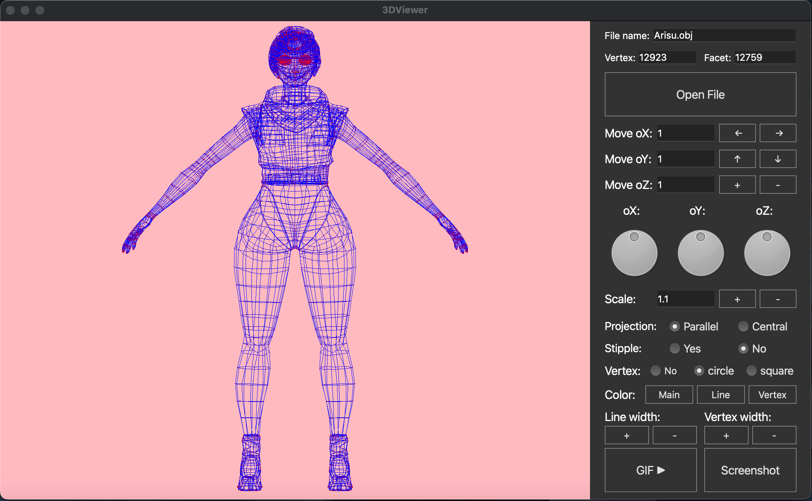

<h1 align="center"> 3D Viewer 2.0 </h1>

### **Описание программы**
В данном проекте наша команда реализовала на языке программирования C++ программу для просмотра 3D моделей в каркасном виде (3D Viewer). Сами модели необходимо загружать из файлов формата .obj. Имеется возможность просматривать их на экране, осуществлять преобразование моделей: вращение, масштабирование и перемещение. 
### **Поддерживаемые функции**



### **Установка**
Для установки программы необходимо использовать команду ```make install``` .
### **Запуск**
Для запуска программы можно использовать команду ```make open``` .
### **Удаление**
Для удаления программы необходимо использовать команду ```make uninstall``` .
